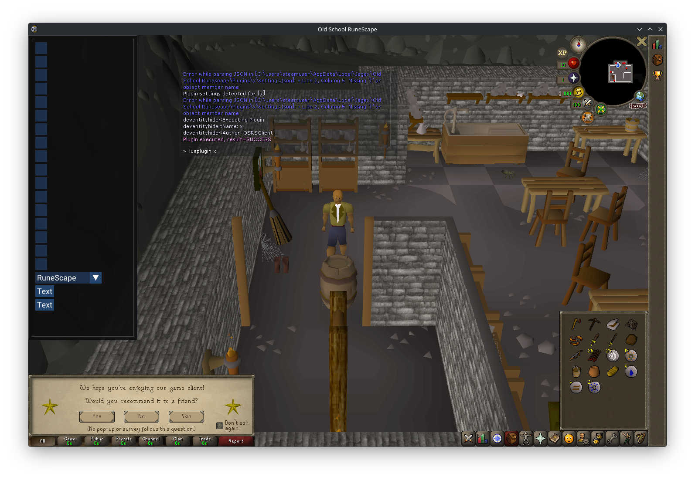

## Commands

### luaplugin 
Runs an installed lua plugin.
Examples:
```
; lists all plugins, even uninstalled ones
luaplugin --list --all

; install and run a developer plugin
luaplugin --install devEntityHider
luaplugin devEntityHider
```

#### --list
Displays all available plugins.
##### Sub-options:
* -all
	* Displays all available plugins
#### --search
Searching for a plugin by text.
#### --install [plugin name]
Installs a plugin by name.
#### --installfromurl [.zip url]
Installs a plugin from a zip url.
#### --uninstall [plugin name]
Uninstalls an existing plugin.
##### Sub-options:
* --all
	* Uninstalls all plugins
* --keep-data
	* Keeps the physical script files on disk
#### --dev
Developer commands.
##### Sub-options:
* --restart
	* Restarts the lua VM
* --clear
	* Crashes my client

## Tool
This repository includes a tool to patch the client to force-enable account-bound features. The source code for this can be seen in main.cpp, and may become outdated with client patches. The signature for updating it is in the code. 

This tool must be ran before logging in. It only works on the native Windows client.